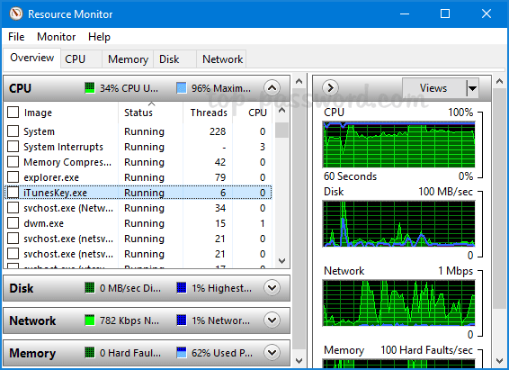

# Node.js Performance & System Fundamentals

> A personal deep-dive into how Node.js actually works under the hood — from CPU cores and threads to the event loop, clustering, and worker threads.

---

## 📖 Why This Repository?

Before optimizing a Node.js application, you need to understand *why* it behaves the way it does at a system level.

This repository explores:

- How programs actually run on hardware
- What the OS kernel does behind the scenes
- What processes, threads, and cores really are
- How Node.js uses (and is limited by) all of the above
- When and why to use **Clustering** or **Worker Threads**

These are the questions I explored step by step — this README is my understanding written out clearly so it's useful for anyone learning these concepts.

---

## 🖥️ How a Program Actually Runs

When you write JavaScript (or any code), it doesn't magically run on the CPU directly. There are several layers in between:

```
Developer writes code
        ↓
OS loads it as a Process
        ↓
Kernel allocates resources (CPU time, RAM)
        ↓
CPU executes instructions
        ↓
Results are stored in RAM / written to Disk
```

| Layer | Role |
|---|---|
| **Process** | Running instance of your program (code + data in memory) |
| **OS / Kernel** | Manages all processes, schedules CPU time, allocates memory & resources |
| **CPU** | Executes the actual instructions of the process |
| **RAM** | Holds the active code and data that the CPU is using right now |
| **Disk** | Stores the program files and persistent/long-term data |

> 📸 The screenshot below (Resource Monitor) shows exactly this in action — each row is a running process, with its own PID, thread count, and CPU share managed by the OS kernel.


*Windows Resource Monitor: Each row is a separate process (PID). Notice the Threads column — `prime95.exe` is pegging the CPU at 100%. This is the kernel in action: allocating CPU time to each process based on priority and availability.*

---

## 🧠 What is the Kernel?

The **kernel** is the core of your operating system. It's not something you interact with directly, but it controls everything.

**What the kernel does:**

- Decides which process/thread gets CPU time (and when)
- Allocates and protects memory (RAM) for each process
- Handles hardware I/O (disk, network, etc.)
- Schedules threads across CPU cores

**One-line mental model:**

> The CPU does the work. The kernel decides *who* gets to use the CPU and *when*.

---

## ⚙️ CPU, Cores, and Logical Processors

### Physical Cores

A **CPU core** is a hardware unit that can execute one thread at a time.

- 8-core CPU → can run **8 threads simultaneously** (in parallel)

### Hyper-Threading / SMT

Modern CPUs (Intel's Hyper-Threading, AMD's SMT) allow each physical core to handle **2 threads at once** by sharing internal resources.

- 8-core CPU with Hyper-Threading → **16 logical processors**
- This is what you see in Task Manager as "logical processors"

> 📸 *Tip:* Open Task Manager → **Performance → CPU** tab on your machine to see your own physical core count vs logical processor count.

### 🔍 How to See All Logical Processors in Detail

By default, Task Manager shows a **single combined CPU graph**. To clearly distinguish physical cores from logical processors:

1. Open **Task Manager** → **Performance** → **CPU** tab
2. **Right-click** anywhere on the CPU graph
3. Select **"Change graph to"** → **"Logical processors"**

This reveals **all 16 individual bars** (one per logical processor), making it immediately visible how Hyper-Threading maps 8 physical cores into 16 logical execution units.

---

## 🧵 What is a Thread?

A **thread** is the smallest unit of execution — a single sequence of instructions the CPU can run.

Think of threads as individual tasks:

- Reading a file from disk
- Handling an incoming HTTP request
- Running a computation
- Rendering a UI element

A **process** owns its threads — but the kernel is what actually creates, schedules, and destroys them. The process (via its main thread) requests thread creation through OS APIs. Every process has at least one thread (the main thread).

---

## 📦 What is a Process?

A **process** is a running program. When you open VS Code, Chrome, or start a Node.js server — each is a separate process.

**Key properties of a process:**

- Has its **own isolated virtual memory space** (RAM)
- Cannot directly access another process's memory
- Contains **one or more threads** (at least the main thread)
- Is created, scheduled, and managed by the OS kernel

**Examples:**
- `node server.js` → 1 Node.js process
- Chrome → many processes (one per tab, plus GPU, network, etc.)


*Task Manager → Processes tab: Microsoft Edge has **36 processes**, Skype has **7**, Outlook has **2**. Each number in parentheses is a separate OS process — not just a thread. This is intentional: if one tab crashes, it doesn't take down the whole browser.*

---

## ❗ Key Concept: More Threads Than Cores

This is one of the most common confusions.

**You can have 136 threads running on only 8 cores.**

How? Because threads aren't always *actively running*. At any moment, a thread is in one of these states:

| State | Meaning |
|---|---|
| **Running** | Currently executing on a CPU core |
| **Ready** | Waiting for a free core |
| **Waiting / Sleeping** | Blocked on I/O, timer, or lock — not using CPU |

At any given instant, only **8 threads** (on an 8-core machine) are truly running. The rest are waiting.

---

## ⏱️ Context Switching

The OS kernel constantly rotates which threads run on each core. This rotation happens **thousands of times per second** and is called **context switching**.

```
Core 1:  [Thread A] → [Thread B] → [Thread A] → [Thread C] → ...
Core 2:  [Thread D] → [Thread E] → [Thread D] → [Thread F] → ...
```

From a human perspective, it looks like everything is running simultaneously. At the hardware level, threads take turns extremely rapidly.

> **Why this matters for Node.js:** Even though Node.js has only 1 main thread, the OS still context-switches it with other threads/processes on your system.

---

## 🔁 How Everything Relates

```
Processes
 └── Threads (one or more per process)
       └── Scheduled by Kernel
             └── onto Logical Processors (with Hyper-Threading)
                   └── on Physical Cores
                         └── inside CPU
```

- **Processes** own threads
- **Kernel** schedules threads onto logical processors
- **Logical processors** map to physical cores (via Hyper-Threading)
- **Physical cores** are the actual hardware that executes instructions

---

## ⚡ Node.js Execution Model

By default, a Node.js application runs as:

- **1 process**
- **1 main thread** — the Event Loop

This means: even if your machine has 8 cores, a basic Node.js app uses only **1 core** at a time for JavaScript execution.

### The Event Loop

The Event Loop is what makes Node.js "fast" despite being single-threaded.

Instead of blocking and waiting, Node.js:

1. Receives a request (e.g., read a file)
2. Delegates the blocking work (to OS or thread pool)
3. Continues handling other requests
4. When the work is done, gets notified via a callback

```
Request → Event Loop → Delegate I/O → Continue other work
                             ↓
                   I/O completes → Callback fires
```

> Node.js is **non-blocking**, not multi-threaded (for JavaScript execution).

---

## 🧵 libuv Thread Pool

Node.js uses **libuv**, a C library that provides the event loop and a thread pool.

**Default thread pool size: 4 threads** (configurable via `UV_THREADPOOL_SIZE`)

The thread pool handles operations that cannot be made non-blocking at the OS level:

| Operation | Uses Thread Pool? |
|---|---|
| File system I/O (`fs.*`) | ✅ Yes |
| `dns.lookup()` (blocking DNS) | ✅ Yes |
| Crypto (`bcrypt`, `pbkdf2`, `scrypt`) | ✅ Yes |
| `dns.resolve()` (non-blocking DNS) | ❌ No — uses OS async |
| Network I/O (TCP, HTTP) | ❌ No — OS handles async |

> These 4 threads are managed by the OS and can run on any available CPU core — giving Node.js limited multi-core capability even without clustering.

> 📸 The Resource Monitor below shows this exact reality — hundreds of threads exist across processes, but only a handful actually consume CPU at any moment:


*Windows Resource Monitor → CPU tab: `System` has **228 threads**, `explorer.exe` has **79 threads** — yet CPU usage stays low. Most threads are in a **Waiting** state (blocked on I/O or sleeping). Only the kernel schedules them onto cores when they have work to do.*

---

## ❗ Async ≠ Multithreading

Many developers confuse these two. They are completely different ideas.

| Concept | What it actually means | In Node.js |
|---|---|---|
| **Async** | Non-blocking — the main thread does **not** wait for slow operations | Event Loop keeps running |
| **Multithreading** | True parallel execution on multiple threads/cores at the same time | Only the libuv thread pool (4 threads) does this |

- **Async** = "Don't make my main thread wait."
- **Multithreading** = "Run multiple things at the exact same time on different cores."

---

### Example 1 — Classic Async (Callback Style)

```js
console.log("1. Starting...");

fs.readFile("data.txt", (err, data) => {
  console.log("3. File content:", data); // ← runs LATER
});

console.log("2. This runs immediately!");
```

**What happens:**
- `fs.readFile` hands the work to the **libuv thread pool** and immediately returns
- `console.log("2. This runs immediately!")` runs right away — the main thread never blocked
- When the file is ready, the callback fires back on the **main thread**

---

### Example 2 — Async/Await (Modern Style)

```js
async function readFileExample() {
  console.log("1. Starting...");

  const data = await fs.promises.readFile("data.txt", "utf8");

  console.log("2. File content:", data); // ← waits, but without blocking

  console.log("3. Done!");
}
```

**What happens:**
- `await` pauses **only this function** — not the entire app
- The Event Loop stays free and can handle other requests in the meantime
- Code reads top-to-bottom like sync code, but is still **non-blocking**

---

### Summary

- **Async** → operation is offloaded; the main thread moves on; result comes back via callback/promise
- **Multithreading** → multiple pieces of code run simultaneously on different cores

> "Node.js is single-threaded for JavaScript, but async and non-blocking."

---

## 📁 File I/O — Why It Uses a Thread Pool

File reads/writes are **not CPU-intensive**. They are *waiting* operations — waiting for the disk to respond.

```
Main Thread → asks for file read → libuv thread pool handles it
                                          ↓
                              Disk I/O (waiting...)
                                          ↓
                              Data ready → callback fires → Event Loop picks it up
```

The main thread stays free for other work during this entire wait. This is the core advantage of Node's async I/O model.

---

## 🧵 Worker Threads

Worker Threads let you run JavaScript code in **true parallel** on multiple CPU cores — something the Event Loop alone cannot do.

```js
const { Worker, isMainThread, parentPort } = require('worker_threads');

if (isMainThread) {
  // Main thread
  const worker = new Worker(__filename);

  worker.on('message', (result) => {
    console.log('Result from worker:', result);
  });

  worker.postMessage('start');
} else {
  // This runs inside the worker thread
  parentPort.on('message', () => {
    const result = doHeavyComputation(); // CPU-intensive task
    parentPort.postMessage(result);
  });
}
```

**How Worker Threads work:**

- Each worker runs in its own **V8 isolate** — a completely separate JavaScript environment with its own event loop and memory
- Workers communicate with the main thread via `postMessage()` / `parentPort.on('message')`
- Memory is isolated by default; can be explicitly shared using `SharedArrayBuffer` (advanced)

**Is it real multithreading?**

Yes. Unlike the libuv thread pool (which only helps with I/O and crypto), Worker Threads let **your own JavaScript logic** run in parallel on separate CPU cores — inside a single process.

**I/O-Bound vs CPU-Bound (When to use what)**

These terms just describe what is slowing your program down:

- **I/O-bound:** Your app spends most time waiting on stuff outside the CPU — like reading files, hitting databases, network calls, or APIs. The CPU sits idle while it waits. That's why async shines here: the Event Loop keeps going, so there is no freeze.
- **CPU-bound:** The bottleneck is raw computation — big loops, heavy math, image filters, encryption, video encoding. The CPU works hard, no waiting — just grinding. Here, single-threaded JS blocks everything. Worker Threads or clustering help by spreading this work across multiple cores.

**Quick rule:**
- File/network/database? → **I/O-bound** → use async (Event Loop)
- Heavy math/processing? → **CPU-bound** → need parallelism (Worker Threads)

Worker Threads give you real multi-core power while staying inside one process — lighter than spawning separate processes with `cluster`.

---

## ⚙️ Clustering

Clustering creates **multiple Node.js processes**, each with its own Event Loop and memory.

```js
const cluster = require('cluster');
const os = require('os');

if (cluster.isPrimary) {
  const numCPUs = os.cpus().length;
  for (let i = 0; i < numCPUs; i++) {
    cluster.fork(); // Creates a worker process
  }
} else {
  // Each worker runs the server
  require('./server');
}
```

**How it works:**

- Each forked process runs independently
- The primary process distributes incoming connections
- Each worker process can run on a **different CPU core**
- Workers have **completely separate memory** (no sharing)

**Worker Threads vs Clustering:**

| | Worker Threads | Clustering |
|---|---|---|
| Memory | Shared process, isolated JS heaps | Completely separate processes |
| Communication | `postMessage()` | IPC (Inter-Process Communication) |
| Use case | CPU-heavy JS work | Scaling I/O / request handling |
| CPU cores used | Shares process's core allocation | Each process gets its own core |

---

## 🔥 Final Mental Model

| Concept | What it really is |
|---|---|
| **CPU** | The hardware that executes instructions |
| **Core** | A physical execution unit inside the CPU |
| **Logical Processor** | A virtual core (with Hyper-Threading) |
| **Thread** | A unit of work the CPU executes |
| **Process** | A running application with isolated memory |
| **Kernel** | The OS component that schedules everything |
| **Event Loop** | Node's mechanism for non-blocking I/O |
| **libuv** | The library powering Node's async I/O and thread pool |

---

## 🧠 One-Line Summary

> You can have hundreds of threads, but only a few run at any moment — the OS kernel schedules them across available CPU cores, thousands of times per second.

---

---

## 🚀 Next Steps (Experiments)

- [ ] Implement a basic HTTP server and observe its process in Task Manager
- [ ] Add clustering and observe multiple Node.js processes appear
- [ ] Implement a CPU-heavy task with and without Worker Threads — benchmark the difference
- [ ] Adjust `UV_THREADPOOL_SIZE` and observe the impact on concurrent file reads
- [ ] Compare response time: single process vs clustered under load

---

## 📚 References

- [Node.js Docs — Worker Threads](https://nodejs.org/api/worker_threads.html)
- [Node.js Docs — Cluster](https://nodejs.org/api/cluster.html)
- [libuv Documentation](https://libuv.org/)
- [Node.js Event Loop — Official Guide](https://nodejs.org/en/docs/guides/event-loop-timers-and-nexttick)
