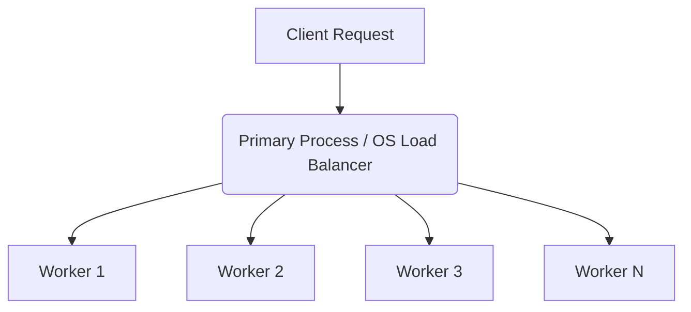
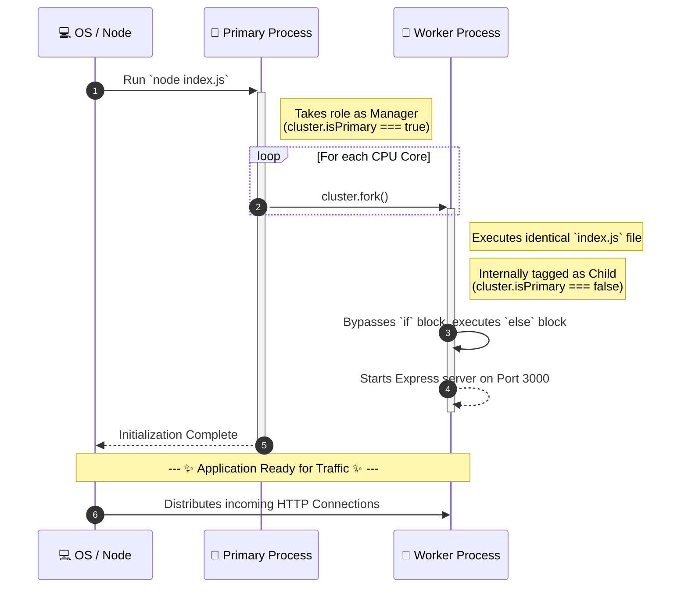

# Node.js Clustering Example

This directory contains a standalone example of how to implement **Node.js Clustering** to utilize multiple CPU cores and enhance application performance. 

## 🧠 Architecture Overview

Node.js runs in a single-threaded event loop. To utilize multi-core systems efficiently, the `cluster` module allows you to create child processes (workers) that share the same server ports.

## Node.js Clustering – Key Notes

### 1. Why `if(cluster.isPrimary)` + `else` exists?

To prevent every process from trying to fork more processes (which would cause a catastrophic infinite loop of forks), we use `cluster.isPrimary` to designate roles:
* **The `if (cluster.isPrimary)` block:** Checks if the current process is the main manager/orchestrator. When you first run `node index.js`, the OS process started is the Primary. It executes this specific block, taking on the role of forking child workers.
* **The `else` block:** The worker processes created by `cluster.fork()` are essentially brand new instances of Node.js that execute `index.js` again from the very top. However, since they were spawned as child node processes, their internal `cluster.isPrimary` flag will be `false`. As a result, their execution bypasses the `if` and falls straight into the `else` block, where they start the actual Express server and begin listening for requests.

### 2. Roles

**Primary Process**
* Forks workers (`cluster.fork()`).
* Monitors workers (`cluster.on('exit')`).
* Does **NOT handle API requests**.

**Worker Processes**
* Run the actual Express server.
* Handle incoming requests.
* Share the same port seamlessly.

### 3. Request Flow

1. App starts → primary process runs.
2. Primary forks multiple workers (based on CPU cores).
3. Each worker runs the same file again.
4. Now `cluster.isPrimary === false` → execution falls to the `else` block.
5. Workers start a server (`app.listen`).
6. OS distributes incoming connections across workers.

### 4. `cluster.on('exit')`
* Triggered when a worker dies/crashes.
* Used to:
  * Log the failure.
  * Restart the worker via `cluster.fork()` (Ensures the app stays resilient and self-healing).

### 5. Production Essentials
**Basic clustering is simple**, but production introduces additional requirements:
* **Logging:** Centralized logs for errors and requests.
* **Monitoring:** Tracking CPU, memory, and latency.
* **Graceful shutdown:** Resolving connections before exiting.
* **Auto-restart workers:** Typically handled via `cluster.on('exit')` or dedicated process managers like PM2.

### 6. Graceful Restart (Important for Zero Downtime)
* **NOT** killing workers after each request ❌.
* Used during **deployment/updates** for zero downtime deployments.

**Flow:**
1. Start new worker (running the new code).
2. Stop old worker from accepting new requests.
3. Let the old worker finish currently processing requests.
4. Kill the old worker.
➡️ Ensures **zero downtime** for users.

### 7. Stateful vs Stateless

**Stateless (Preferred)**
* Example: JWT authentication.
* No need for sticky sessions.
* Any worker can handle any request at any time.

**Stateful**
* Data stored in memory (e.g., shopping cart, specific user session ID).
* Requires **sticky sessions**.
* The same user must hit the exact same worker on subsequent requests, making scaling complex.

### 8. Sticky Sessions
* Not handled manually via inspecting `process.pid`.
* Managed by dedicated load balancers, such as:
  * NGINX
  * AWS ALB (Application Load Balancer)
  * HAProxy

### 9. Clustering vs Worker Threads

| Feature | Node.js Clustering | Worker Threads (`worker_threads`) |
| :--- | :--- | :--- |
| **Purpose** | Scales across multiple CPU cores | Runs CPU-heavy tasks without blocking the event loop |
| **Use Case** | Handling massive parallel I/O requests / Web servers | Heavy computation (image processing, cryptography, massive loops) |
| **Memory** | Independent memory space per worker | Can share memory via `SharedArrayBuffer` |

### 10. Scaling Strategy (Real World)

**Level 1: Single Machine**
* Use clustering (multiple Node.js workers to maximize core usage).

**Level 2: Multiple Machines**
* Use containers (Docker).
* Run multiple container instances across diverse servers.

**Level 3: Production Setup**
* Top-level Load balancer (NGINX / AWS ALB).
* Multiple containers orchestrated by Kubernetes/ECS.
* *(Note: In containerized environments, running single-process pods/containers and letting Kubernetes scale the horizontal instances is generally preferred over doing internal Node.js clustering.)*

> [!TIP]
> ### 💡 Bonus Note: 
> If you are ever asked to summarize Node.js scaling strategy in an interview, keep these core concepts in mind:
> * **"The primary process manages workers; the workers handle the actual requests."**
> * Use **clustering** for multi-core scaling of I/O-heavy Web Servers.
> * Use **worker threads** specifically for isolated, CPU-heavy synchronous tasks.
> * Prefer a **load balancer** to scale horizontally across multiple distinct machines.
> * **Always prefer stateless architecture** (e.g., JWT) to avoid the architectural headaches and bottlenecks that come with sticky sessions.
