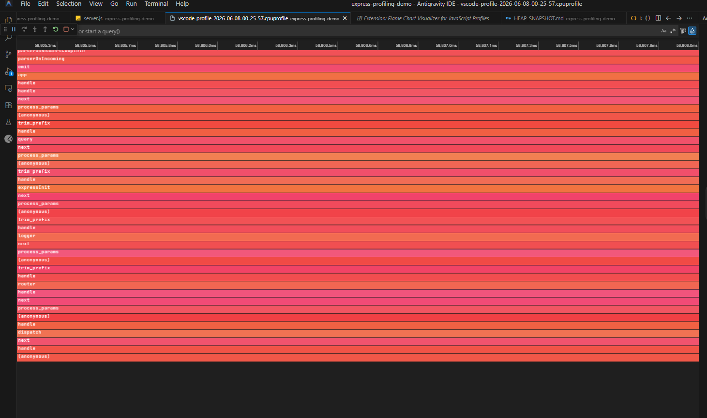

# 🔥 CPU Profiling with VS Code — Manual CPU Profiler + Flame Chart Visualizer

Record a `.cpuprofile` with the **VS Code built-in debugger's CPU profiler** (manual/programmatic mode) and view it as an interactive flame chart via the **`vscode-js-profile-flame`** extension.

This complements the [Clinic.js flame graph](./README.md#-clinic-flame--hottest-frame-comparison) approach: rather than wrapping the whole process, you capture only the exact time window you care about, inside the debugger.

---

## Prerequisites

| Requirement | Details |
|---|---|
| VS Code | Any recent version (≥ 1.80) |
| **Extension** | [JavaScript Profiler (Flame)](https://marketplace.visualstudio.com/items?itemName=ms-vscode.vscode-js-profile-flame) — `ms-vscode.vscode-js-profile-flame` |
| Server script | `server.js` in this repo |

Install the extension from the VS Code Extensions panel (`Ctrl+Shift+X`) and search for **"Flame Chart Visualizer for JavaScript Profiles"**.

---

## How the Manual CPU Profiler Works

The VS Code debugger exposes a **CPU profiler** that you start and stop manually from the **Call Stack** panel (or via the Debug toolbar). When stopped, it writes a `.cpuprofile` file to disk — a JSON file that records every V8 call stack sample taken during that window.

Unlike `clinic flame` (which wraps the whole process), this lets you:

- Profile **only one request** (no warmup noise)
- Start/stop precisely around the code path you suspect
- Keep the server running between recordings

---

## Step 1 — Add a Launch Configuration

Open `.vscode/launch.json` and make sure you have a configuration that **attaches** (or launches) with profiling support.

The existing `"Launch Program"` configuration in this project already works. You can also add a dedicated profiling config:

```json
{
  "type": "node",
  "request": "launch",
  "name": "Launch + CPU Profile",
  "skipFiles": ["<node_internals>/**"],
  "program": "${workspaceFolder}\\server.js"
}
```

> No special flags are needed — the VS Code debugger always starts Node in `--inspect` mode internally.

---

## Step 2 — Start the Debugger

Press **`F5`** (or `Run → Start Debugging`) with the `Launch Program` (or `Launch + CPU Profile`) configuration selected.

The integrated terminal / Debug Console shows:
```
Server running on http://localhost:3000
```

---

## Step 3 — Start the CPU Profiler (Manual)

In the **Run and Debug** sidebar (`Ctrl+Shift+D`), look at the **Call Stack** panel.

1. Right-click on the running Node.js process **or** click the ▶ record button that appears next to your process name.
2. Select **`Start CPU Profile`**.

> The status bar at the bottom turns amber with a 🔴 indicator — profiling is active.

---

## Step 4 — Trigger the Slow Endpoint

While the profiler is running, open a browser or run `curl` to hit the slow endpoint:

```bash
curl http://localhost:3000/slow-cpu
```

The 500M-iteration loop will block the event loop for several seconds — this is the window you want to capture.

You can also use Autocannon for a short burst:

```bash
npx autocannon -c 1 -d 5 http://localhost:3000/slow-cpu
```

---

## Step 5 — Stop the CPU Profiler

Back in the **Call Stack** panel (or Debug toolbar):

1. Click **`Stop CPU Profile`** (the same button you used to start, now showing a stop icon).

VS Code will prompt you to save the `.cpuprofile` file. Save it inside the project directory, for example:

```
vscode-profile-2026-06-08-00-25-57.cpuprofile
```

> The file is saved automatically if you used a keybinding, or you can pick the save location in the dialog.

---

## Step 6 — Open with Flame Chart Visualizer

Once the `.cpuprofile` is saved:

1. In the **Explorer** panel (`Ctrl+Shift+E`), right-click the `.cpuprofile` file.
2. Select **`Open with...`** → **`Flame Chart Visualizer for JavaScript Profiles`**.

   Or open it directly — VS Code will automatically detect the extension if `vscode-js-profile-flame` is installed and open it in the flame chart view.

You will see an interactive horizontal flame chart like the one below:



### What You're Seeing

The screenshot above was recorded against this server's `/slow-cpu` route. Key observations:

| Layer (top → bottom) | Frame | Meaning |
|---|---|---|
| Top | `parserOnHeadersComplete` | HTTP request parsed by Node's built-in `http` module |
| Mid | `emit` → `app` → `handle` → `next` | Express request pipeline dispatching through middleware |
| Mid | `process_params` → `(anonymous)` → `trim_prefix` | Express Router resolving path parameters |
| Mid | `expressInit`, `logger`, `query`, `router` | Registered middleware running in order |
| Bottom | `dispatch` → `handle` → `(anonymous)` | Final route handler — **this is where your code runs** |

> **The wide horizontal bands in red/orange indicate frames that consumed the most wall-clock time.** The anonymous handler at the bottom maps directly to the `router.get('/slow-cpu', ...)` callback in `slowCpu.route.js`.

---

## Reading the Flame Chart

```
Wide bar = long time in that frame
Narrow bar = short time (or called rarely)
```

**For `/slow-cpu`:**
- The entire chart is dominated by Express internals wrapping the single route handler.
- Click any bar to highlight that frame and see its **self time** vs **total time** in the sidebar.
- Hover to see the **file path**, **line number**, and **time spent**.

### Flame Chart Controls

| Action | Result |
|---|---|
| **Click a frame** | Focus + show self/total time |
| **Scroll horizontally** | Pan through the timeline |
| **Ctrl + scroll** | Zoom in/out on the time axis |
| **Type in the search box** | Filter frames by function name or file |

---

## Comparing with Clinic Flame

| Feature | Clinic Flame | VS Code CPU Profiler + Flame Extension |
|---|---|---|
| Setup | `npx clinic flame -- node server.js` | F5 in VS Code debugger |
| Recording window | Whole process lifetime | Manual start/stop — precise window |
| Output | HTML report in browser | `.cpuprofile` → VS Code flame chart |
| Breakpoints during profiling | ❌ No | ✅ Yes — debugger is attached |
| Shareable artifact | HTML file | `.cpuprofile` file (JSON) |
| Best for | Quick diagnosis of any endpoint | Targeted capture of a specific request |

---

## Saved Profile in This Repo

The file [`vscode-profile-2026-06-08-00-25-57.cpuprofile`](./vscode-profile-2026-06-08-00-25-57.cpuprofile) was recorded manually against the `/slow-cpu` endpoint using the steps above.

Open it in VS Code with the **Flame Chart Visualizer** extension to reproduce the flame chart shown in the screenshot.

---

## Tips

- **Profile in a fresh session** — restart the server so module-level caches don't skew the first-request timing.
- **Hit the endpoint once before profiling** — let V8 JIT-compile the hot path, then profile the second request for a realistic picture.
- **Search for your file name** — type `slowCpu` in the flame chart search box to jump straight to your route handler frame.
- **Compare two profiles** — save a profile for `/fast` and one for `/slow-cpu`, then open both side by side to see the difference visually.
- **Self time vs Total time** — *self time* is the time the CPU spent in that specific function (excluding callees); *total time* includes all child frames. Look for high *self time* to find the actual bottleneck.
