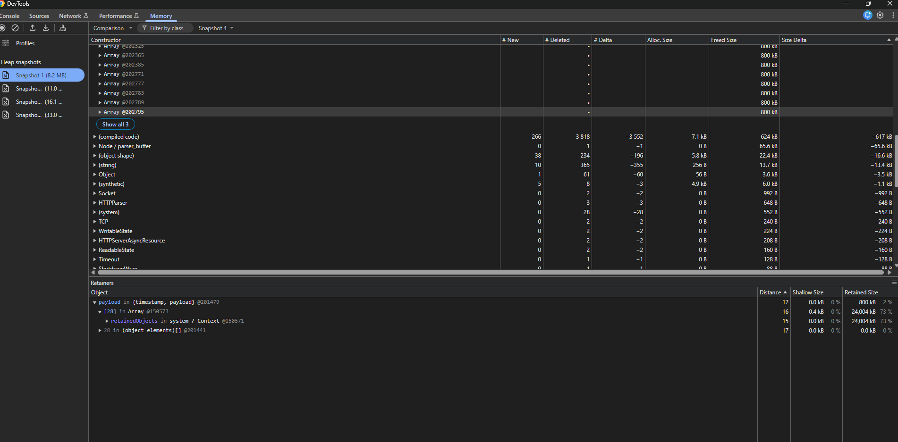

# 📸 Taking a Heap Snapshot (Chrome DevTools)

A step-by-step guide to capturing and analysing a V8 heap snapshot from your running Node.js / Express server using Chrome DevTools.

---

## Prerequisites

- Server running in inspect mode:
  ```bash
  npm run inspect
  ```
  You should see:
  ```
  Debugger listening on ws://127.0.0.1:9229/...
  Server running on http://localhost:3000
  ```

---

## Step 1 — Open Chrome Inspector

Open **Google Chrome** and navigate to:

```
chrome://inspect
```

---

## Step 2 — Connect to your Node process

Under **"Remote Target"**, your server will be listed. Click the **`inspect`** link beneath it.

> A dedicated Chrome DevTools window will open, attached to your Node.js process.


---

## Step 3 — Go to the Memory tab

In the DevTools window that opened, click the **`Memory`** tab in the top navigation bar.

---

## Step 4 — Select snapshot type

Select **`Heap snapshot`** (it is the default option).

---

## Step 5 — Trigger some load (optional but recommended)

Before taking the snapshot, generate memory activity so there is something meaningful to inspect.

Open your **browser** and visit:

```
http://localhost:3000/leak
```

Refresh the page several times (or keep hitting **F5**) to send multiple requests to the leak endpoint, growing the heap with each request.

---

## Step 6 — Take the snapshot

Click the **`Take snapshot`** button (or the ⏺ circle icon on the left panel).

> It may take a few seconds to complete. The snapshot will appear in the left sidebar as **`Snapshot 1`** with its size shown.

---

## Step 7 — Analyse the snapshot

Switch the view dropdown to **`Comparison`** and select a baseline snapshot to diff against.



| View | What it shows |
|---|---|
| **Summary** | Objects grouped by constructor — quickly see what dominates the heap |
| **Comparison** | Diff between two snapshots — find what objects grew |
| **Containment** | Full object reference graph — trace retainer chains |
| **Statistics** | Pie chart breakdown of memory by category |

### Recommended columns to sort by

- **Shallow Size** — memory held directly by the object
- **Retained Size** — total memory freed if this object were GC'd (more useful)
- **# Delta** — net new objects created between snapshots (key for leak hunting)

---

## 🔍 Leak Detection Technique — Three Snapshot Method

Take **three snapshots** with load between each to isolate growing objects:

```
[Snapshot 1] → GET http://localhost:3000/leak (×300) → [Snapshot 2] → GET http://localhost:3000/leak (×300) → [Snapshot 3]
```

1. Open **Snapshot 3**
2. Switch the view dropdown to **`Comparison`**
3. Compare against **Snapshot 1**
4. Sort by **`# Delta`** (new objects created)

Anything with a consistently positive delta across snapshots is a **leak suspect**.

> In the screenshot above you can see `payload in {timestamp, payload}` retained at Distance 17 with 24 MB retained size — a classic sign of objects being held in a growing array and never released.

---

## Tips

- **Filter by constructor** — type a class/function name in the filter box to narrow results.
- **Retainers panel** — click any object in the snapshot to see what is keeping it alive in the bottom panel.
- **Distance column** — shows how many hops from the GC root; high distance = deeply buried object.
- Take snapshots **before any load** as a baseline, then compare after.
