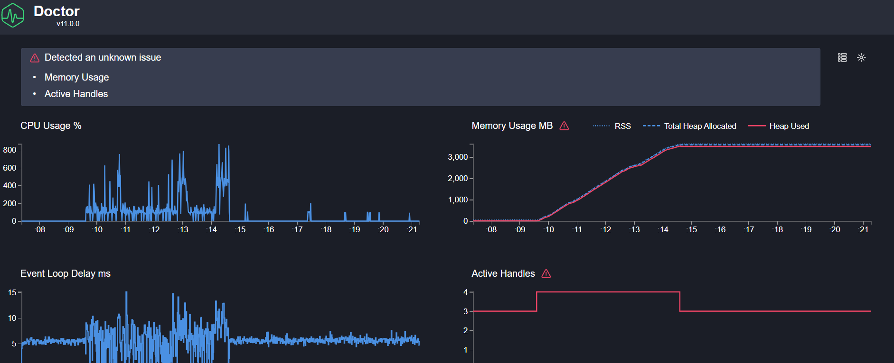
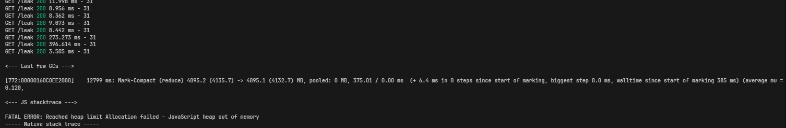

# Express Profiling Demo

An intentionally broken Express.js server for learning Node.js performance troubleshooting with **Clinic.js** and **Autocannon**.

---

## Folder Structure

```
express-profiling-demo/
├── server.js                  # Entry point — mounts all routes
├── package.json
├── README.md
└── routes/
    ├── fast.route.js          # ✅ Healthy — returns immediately
    ├── slowCpu.route.js       # ❌ Blocks the event loop (CPU)
    └── leak.route.js          # ❌ Grows heap unboundedly (memory)
```

---

## Endpoints

| Route           | Behaviour                                         | Problem                            |
| --------------- | ------------------------------------------------- | ---------------------------------- |
| `GET /fast`     | Returns `{status:"ok"}` instantly                 | None — baseline healthy endpoint   |
| `GET /slow-cpu` | Runs a 500M-iteration synchronous loop            | Blocks the event loop completely   |
| `GET /leak`     | Pushes a 100k-item array to a module-level global | Heap grows forever, no GC recovery |

---

## Installation

```bash
# 1. Enter the project directory
cd express-profiling-demo

# 2. Install runtime + dev dependencies
npm install

# 3. Install Clinic.js and Autocannon globally (optional but handy)
npm install -g clinic autocannon
```

---

## Running the Server

```bash
node server.js
# Server running on http://localhost:3000
```

---

## Generating Load with Autocannon

Open a **second terminal** while the server is running.

```bash
# Hammer /fast — should return thousands of req/s
npx autocannon -c 10 -d 10 http://localhost:3000/fast

# Hammer /slow-cpu — throughput will be near zero; event loop is blocked
npx autocannon -c 10 -d 30 http://localhost:3000/slow-cpu

# Hammer /leak — watch memory climb in Task Manager / Activity Monitor
npx autocannon -c 5 -d 60 http://localhost:3000/leak
```

### Autocannon flags

| Flag   | Meaning                      |
| ------ | ---------------------------- |
| `-c N` | N concurrent connections     |
| `-d N` | Duration in seconds          |
| `-p N` | Pipelining factor (optional) |

---

## Profiling with Clinic.js

Clinic.js **wraps** `node server.js`. It starts the server, lets you run load, and generates an HTML report when you stop the server (`Ctrl+C`).

### 1. Clinic Doctor — General diagnosis

Use this **first**. It auto-detects event-loop blocking, memory leaks, and I/O issues.

```bash
# Terminal 1 — start server under Doctor
npx clinic doctor -- node server.js

# Terminal 2 — generate load
npx autocannon -c 10 -d 20 http://localhost:3000/slow-cpu
# or
npx autocannon -c 5  -d 30 http://localhost:3000/leak

# Terminal 1 — Ctrl+C → HTML report opens automatically
```

**What to look for:**

- `/slow-cpu` → Red **"Event Loop Blocked"** warning; delay graph spikes to seconds.
- `/leak` → Red **"Potential Memory Leak"** warning; heap graph trends up with no GC drops.

---

### 2. Clinic Flame — CPU bottlenecks

Use this when Doctor flags an event-loop problem and you need to find _which code_ is responsible.

```bash
# Terminal 1
npx clinic flame -- node server.js

# Terminal 2
npx autocannon -c 10 -d 20 http://localhost:3000/slow-cpu

# Terminal 1 — Ctrl+C → flame graph opens in browser
```

**What to look for:**

- The widest horizontal bar in the flame graph will be labelled **`slowCpu.route.js`**.
- The `for` loop inside the `router.get` handler is the hottest frame — that is your bottleneck.

---

### 3. Clinic HeapProfiler — Memory leaks

Use this when Doctor flags a memory leak and you need to find _where_ the allocations come from.

```bash
# Terminal 1
npx clinic heapprofile -- node server.js

# Terminal 2
npx autocannon -c 5 -d 60 http://localhost:3000/leak

# Terminal 1 — Ctrl+C → heap report opens in browser
```

**What to look for:**

- The largest allocation site will point to **`leak.route.js`** and the `retainedObjects.push(...)` call.
- The heap chart grows monotonically — no sawtooth GC recovery pattern.

---

## Which Profiler for Which Problem?

| Symptom                                         | Tool                 | npm script                    |
| ----------------------------------------------- | -------------------- | ----------------------------- |
| High latency, low throughput, event-loop delays | `clinic doctor`      | `npm run profile:doctor:cpu`  |
| CPU pegged, need exact line                     | `clinic flame`       | `npm run profile:flame`       |
| Heap growing, OOM crashes                       | `clinic heapprofile` | `npm run profile:heap`        |
| General first-look diagnosis                    | `clinic doctor`      | `npm run profile:doctor:fast` |

---

## npm Scripts Reference

```bash
npm start                      # plain node server.js

npm run profile:doctor:fast    # doctor — load against /fast
npm run profile:doctor:cpu     # doctor — load against /slow-cpu
npm run profile:doctor:leak    # doctor — load against /leak

npm run profile:flame          # flame graph  (best for CPU issues)
npm run profile:heap           # heap profile (best for memory leaks)

npm run load:fast              # autocannon /fast      10c 10s
npm run load:slow-cpu          # autocannon /slow-cpu  10c 30s
npm run load:leak              # autocannon /leak       5c 60s
```

> **Note:** The `profile:*` scripts start the server under Clinic. You still need to run
> an `autocannon` command in a **second terminal**, then `Ctrl+C` the profiler to generate the report.

---

## Interpreting Results

### `GET /slow-cpu`

1. **Doctor report** → Event Loop section turns red; delay > 1 s per tick.
2. **Flame graph** → Widest bar = `slowCpu.route.js` → anonymous handler → `for` loop.
3. **Root cause** → The 500M-iteration loop inside `routes/slowCpu.route.js`.

### `GET /leak`

1. **Doctor report** → Memory section trends upward with no GC drops.
2. **Heap report** → Top allocation = array of strings in `routes/leak.route.js`.
3. **Root cause** → Module-level `retainedObjects` array in `routes/leak.route.js`.

### `GET /fast`

- All Clinic.js metrics stay green — use as a **control/baseline** to compare against the broken endpoints.

---

## Tips

- Always run Autocannon in a **separate terminal** from Clinic.
- Let load run for at least **20–30 seconds** so Clinic collects enough samples.
- The `.clinic/` output directory is already in `.gitignore`.
- Each Clinic run creates a timestamped sub-folder inside `.clinic/` — old reports are preserved.

---

## ⚠️ Avoiding OOM Crashes During `/leak` Profiling

Running `/leak` with high concurrency (e.g. `-c 1000`) will exhaust the Node.js heap before
Clinic has a chance to write its trace files, causing:

```
FATAL ERROR: Reached heap limit Allocation failed - JavaScript heap out of memory
Error: No files matching the pattern found
```

> **What that output means:** Right before the crash, your heap usage reached around **4 GB**.
> Node's garbage collector was trying to keep the heap under that limit, but the allocation
> demand from the leak kept growing faster than GC could free memory — so it hit the hard
> ceiling and the process was killed.

**Clinic Doctor report** — Memory Usage (top-right) climbs steadily to ~3,000 MB then flatlines at the heap limit before the crash:



**Terminal output** — the last few GC cycles show the Mark-Compact collector trying to reduce from 4,095 MB → 4,095 MB (no progress), then the fatal OOM:



**Use low concurrency** so the process survives long enough for Clinic to collect data and generate the report:

```bash
# Terminal 1 — start under Clinic
npx clinic doctor -- node server.js

# Terminal 2 — low concurrency, long enough duration
npx autocannon -c 5 -d 30 http://localhost:3000/leak

# Terminal 1 — Ctrl+C → report generates successfully
```

The same applies to `clinic flame` and `clinic heapprofile` against the `/leak` endpoint.
