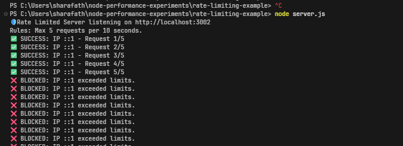

# 🛡️ API Rate Limiting in Node.js

A minimal implementation of rate limiting in Node.js, along with a breakdown of how it works in real-world production systems.

---

## 🚨 Why Rate Limiting Matters

Without rate limiting, your system is vulnerable to:

* **Abuse & Spam** — bots can flood endpoints
* **Brute-force attacks** — especially on `/login`
* **Resource exhaustion** — CPU & DB overload
* **DDoS attacks** — service disruption

👉 Rate limiting ensures **fair usage and system stability**

---

## ⚙️ Example Behavior

This project implements a simple rule:

> **Max 5 requests per 10 seconds per IP**

### Result:

* First 5 requests → ✅ Allowed
* 6th request → ❌ `429 Too Many Requests`
* After 10 seconds → 🔄 Reset



---

## 🚀 Run Locally

```bash
node server.js
```

Test:

* Open: http://localhost:3002
* Refresh quickly to trigger the limit

---

## ⚠️ IP Address Handling (Important)

In production, your app is usually behind:

* Load balancers
* Reverse proxies (NGINX)
* CDNs

So this:

```js
req.socket.remoteAddress
```

❌ Often gives **proxy IP**, not real user

---

### ✅ Correct Approach

```js
const ip =
  req.headers['x-forwarded-for']?.split(',')[0] ||
  req.socket.remoteAddress;
```

If using Express:

```js
app.set('trust proxy', true);
```

---

## 🌍 Production Architecture

```
Client
  ↓
CDN (Cloudflare)
  ↓
Load Balancer
  ↓
API Servers (multiple instances)
  ↓
Redis (shared store)
```

---

## 🔥 Distributed Rate Limiting

In production, you will have **multiple servers**.

👉 Problem:

* In-memory (`Map`) → ❌ Not shared

👉 Solution:

* Use **Redis**

---

### Flow:

1. Request hits API server
2. Extract user/IP
3. Check counter in Redis
4. If exceeded → return `429`
5. Else → increment and allow

---

## 🧠 Rate Limiting Strategies

| Strategy       | Description                |
| -------------- | -------------------------- |
| Fixed Window   | Simple, but allows bursts  |
| Sliding Window | More accurate              |
| Token Bucket   | Best for controlled bursts |

---

## 🧩 Route-Level Control (Middleware)

Different endpoints need different limits:

* `/login` → strict (5 req/min)
* `/api/data` → relaxed (100 req/min)

👉 Implement using middleware

---

## 👤 User-Based Limiting

IP-based limiting is weak (VPN, shared networks)

Better:

```js
const key = userId || ip;
```

---

## 📊 Standard Response Headers

Production APIs should return:

```http
X-RateLimit-Limit: 5
X-RateLimit-Remaining: 2
Retry-After: 10
```

---

## 🚨 DDoS Attacks

A DDoS attack uses:

* Thousands of machines (botnet)
* Automated scripts (not humans)

👉 IP rate limiting alone is **not enough**

---

## 🛡️ Real Protection (Upstream)

Handled by:

* Cloudflare
* AWS Shield

---

### How They Work

* Detect abnormal traffic patterns
* Identify bot behavior
* Block or challenge requests
* Filter traffic before it hits your server

---

## 🔐 CAPTCHA (When Suspicious)

* Triggered only for suspicious traffic
* Forces human verification
* Blocks automated bots

👉 Not applied to all requests

---

## ⚖️ When to Use What

| Scale        | Approach                  |
| ------------ | ------------------------- |
| Small app    | In-memory limiter         |
| Medium app   | Redis + middleware        |
| Large system | CDN + Redis + API Gateway |

---

## 🧠 Final Takeaway

Rate limiting in production is **layered**:

* **Application Layer** → enforce limits
* **Redis** → shared state
* **Infrastructure (CDN)** → block attacks
* **CAPTCHA** → verify humans

---

## 🚀 Summary

* for production always combine:

  * Redis
  * Proper IP detection
  * Middleware
  * Upstream protection

---

