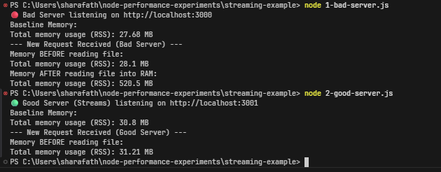

# Node.js Streams – Short Note & Example

This directory contains examples demonstrating the power of **Streams** in Node.js, particularly for handling large amounts of data (like files) without eating up all your server's RAM.

## 🧠 Why Streams? (The Problem)

Normally, when you read a file in Node.js using `fs.readFile` (or `fs.readFileSync`), Node.js reads the **entire file into memory (RAM)** before it can send it to the client.

* **Small files:** This is fine.
* **Large files (e.g., a 1GB video):** This is a disaster. If 10 users request the 1GB video at the same time, your Node.js server will try to allocate 10GB of RAM. It will likely crash with an `Out of Memory` error.

## 🌊 The Solution: Streams

Streams allow you to process data **chunk by chunk** instead of waiting for the entire payload to be loaded.

* It reads a small piece of the data (chunk) from the disk.
* It sends that piece to the client immediately.
* It throws out that piece from memory and reads the next one.

**Benefits:**
1. **Low Memory Usage:** Your RAM usage stays tiny and stable, even when sending a 10GB file.
2. **Faster Time to First Byte (TTFB):** The client starts receiving data almost instantly, instead of waiting for the server to load the whole file into RAM first.

## 🛠️ Running the Examples

### 1. Generate a Large Dummy File
First, we need a large file to test with. Run this script to generate a ~400MB text file:
```bash
node generate-large-file.js
```
*(This will create a `large-file.txt` in this folder)*

### 2. Run the Bad Approach (No Streams)
```bash
node 1-bad-server.js
```
* Open a browser and go to `http://localhost:3000`.
* Watch your terminal. You will see the memory usage spike massively (often hundreds of MBs), because it loads the whole file into memory before sending it.

### 3. Run the Good Approach (With Streams)
```bash
node 2-good-server.js
```
* Open a browser and go to `http://localhost:3001`.
* Watch your terminal. You will see the memory usage stays incredibly low (often under 30MB), no matter how big the file is! This is because it streams the file in small chunks.

### 📊 The Results

Here is a side-by-side comparison of the terminal outputs. Notice how the bad server spikes to over 500MB of RAM, while the good server stays steadily around 30MB:



---

✅ **One-line summary:** Stream processes data piece-by-piece rather than loading everything into memory at once, preventing memory explosion and improving initial response times for large files.
